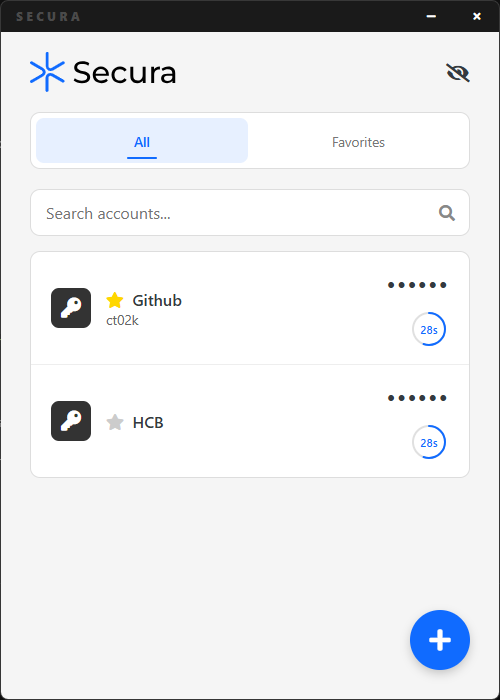

# Secura Authenticator

A simple TOTP (Time-based One-Time Password) authenticator app built with Electron. This is my first real program using Electron, so it may not be suitable for real use.

## ⚠️ Important Disclaimer

This is a learning project and my first experience with Electron development. While functional, it may have security vulnerabilities or bugs.
Use at your own risk and consider established authenticators like Google Authenticator, Authy, or Microsoft Authenticator for important accounts.

## Features

- 🔐 Generate TOTP codes compatible with standard 2FA implementations
- ⭐ Mark tokens as favorites for easy access
- 🔍 Search through your tokens by name or account
- 👁️ Show/hide codes
- ⏱️ Visual timer showing when codes refresh (every 30 seconds)

## Screenshots



## How to Use

1. Click the "+" button to add a new token
2. Enter the service name, account (optional), and the secret key (Base32 format)
3. Click "Add" to save the token
4. Click on any code to copy it to clipboard
5. Use the eye icon to show/hide codes
6. Star tokens to mark them as favorites
7. Use the search bar to find specific tokens

## Installation & Setup

### Prerequisites
- Node.js (v14 or higher)
- npm

### Running the App

```bash
# Install dependencies
npm install

# Start the application
npm start
```

### Building the App

```bash
# Build for your current platform
npm run build
```

## Technical Details

- **Framework**: Electron
- **Authentication**: TOTP using `otplib` library
- **Data Storage**: JSON file in user data directory
- **Security**: Context isolation enabled, no remote modules

## File Structure

```
secura/
├── index.js          # Main Electron process
├── preload.js        # Preload script for secure IPC
├── renderer.js       # Renderer process (UI logic)
├── index.html        # Main UI
├── style.css         # Styling
├── package.json      # Dependencies and scripts
└── assets/           # Icons and images
```

## Dependencies

- `electron` - Cross-platform desktop app framework
- `electron-builder` - Tool for packaging Electron apps
- `otplib` - TOTP code generation

## Known Limitations

- No encryption of stored tokens (they're saved as plain text)
- No backup/sync functionality
- No import/export from other authenticators
- Basic error handling
- No automated tests
- UI probably not optimized for different screen sizes
- No dark mode
